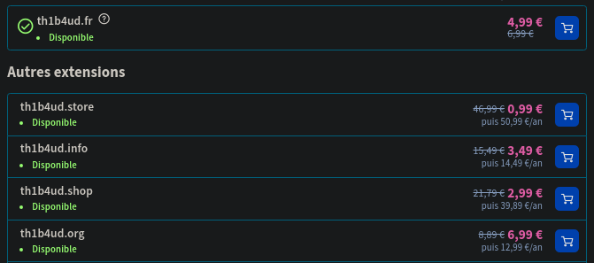
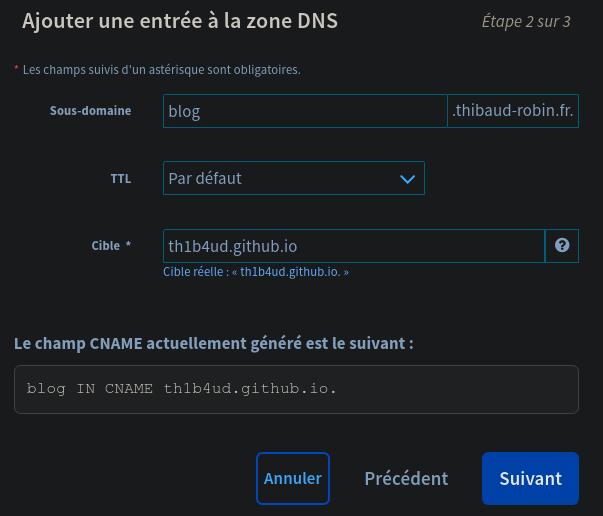
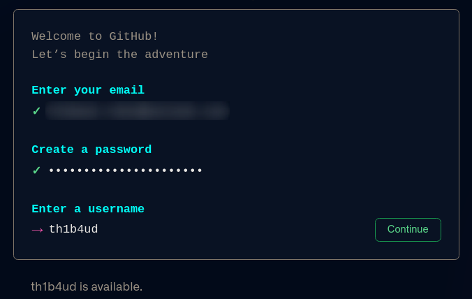
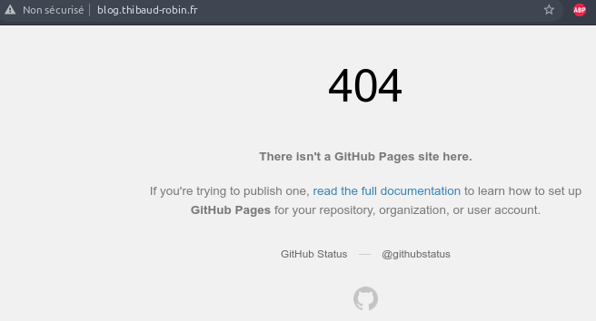
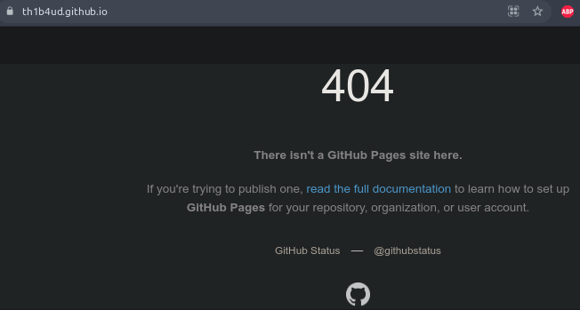

+++
categories = ["Articles", "Web"]
date = "2022-01-23"
title = "Taking over domains to become a billionaire"
subtitle = "Tiny misconfiguration, huge profit"
thumbnail = "/img/money.svg"
nopaging = "false"
+++

Hello there !

I hope all is well with you despite these difficult days. I wish you all a very happy New Year 2022. I'd like to tell you about a little known but potentially annoying vulnerability: domain and subdomain takeover.

# Introduction

But before start you have to know several things about domain name system also known as DNS.

> The Domain Name System (DNS) is the hierarchical and decentralized naming system used to identify computers, services, and other resources reachable through the Internet or other Internet Protocol (IP) networks.

More simply, it is this service that allows a network address to be resolved into a host name. There are several records that can be used to configure a DNS service (below are the most useful for this article):

- **A record** or address record which maps a host name, domain name or subdomain to a 32-bit, four-byte IPv4 address e.g. 123.234.1.2.
- **AAAA record** or IPv6 address record which maps a host name to a 128-bit, sixteen-byte IPv6 address.
- **CNAME record** or canonical name record which allows one domain to be aliased to another.
- **MX record** or mail exchange record which defines the mail servers for this domain.
- **NS record** or name server record which defines the DNS servers for this domain.

To illustrate this article I will use my own domain to carry out my various tests and illustrate the bad configurations

# Identify your target

First thing to do is to collect maximum informations about your target. If the objective is to take control on domain and subdomains, it should be interesting to start with subdomain discovery scans.

## Let's bruteforce...

Like everyone else, it is legitimate to start with the classic tools that everyone else uses. Below I use dnsrecon and dnscan but there are dozens of others.

Subdomain bruteforce with `dnsrecon` : https://github.com/darkoperator/dnsrecon

```py
python3 dnsrecon.py -d thibaud-robin.fr -D subdomains-top1mil-20000.txt -t brt
[*] Using the dictionary file: subdomains-top1mil-20000.txt (provided by user)
[*] brt: Performing host and subdomain brute force against thibaud-robin.fr...

[+] 	 CNAME blog.thibaud-robin.fr th1b4ud.github.io
[+] 	 A th1b4ud.github.io 185.199.108.153
...
[+] 	 CNAME www.thibaud-robin.fr thibaudrobin.github.io
[+] 	 A thibaudrobin.github.io 185.199.108.153
```

Subdomain bruteforce with `dnsrecon` : https://github.com/rbsec/dnscan

```py
python3 dnscan.py -d thibaud-robin.fr -w subdomains-10000.txt --nocheck
[*] Processing domain thibaud-robin.fr
[*] Scanning thibaud-robin.fr for A records
185.199.110.153 - thibaud-robin.fr            
...
185.199.108.153 - www.thibaud-robin.fr             
...
185.199.108.153 - blog.thibaud-robin.fr                    
```

The two tools give similar results and an interesting element was discovered. However, it is possible to do even better in terms of completeness.



We don't want that, do we? :)

## ...but wisely !

Therefore, the enumeration must be repeated in a wiser way. Another tool I like is [massdns](https://github.com/blechschmidt/massdns). This tool offers the possibility to choose on which record to filter (and by default on the A like all other tools)

The tool is particularly ugly and very impractical to use, but it does the job. The `-t` option allows you to change the record. Here I put MX but I could have put CNAME or something else.

```
/massdns # ./scripts/subbrute.py subdomains-top1million-5000.txt thibaud-robin.fr | ./bin/massdns -r lists/resolvers.txt -t MX -o S -w output.txt

/massdns # cat output.txt 
mail.thibaud-robin.fr. MX 10 mx6.th1b4ud.fr.
mail.thibaud-robin.fr. MX 1 mx1.th1b4ud.fr.
app.thibaud-robin.fr. CNAME app-42-th1b4ud-dev.azurewebsites.net.
blog.thibaud-robin.fr. CNAME th1b4ud.github.io.
www.thibaud-robin.fr. CNAME thibaudrobin.github.io.
```

Ok great! This time we have everything we want. So about the different subdomains above, are they secure? Not really. It is possible **to take control of at least 3 of them.** Do you know how?

# Time to take over !

## Domain takeover

As seen previously, the DNS CNAME record allows you to make an alias by displaying the contents of another domain. This can be very useful if you want to act transparently for your users. Indeed it allows you to display only one domain name which will take care of displaying the content hosted elsewhere on another domain (and it can be dynamic this time).

So, if I develop an application on `th1b4ud.fr`, I can set a CNAME record on `thibaud-robin.fr` pointing to `th1b4ud.fr`. Like this, I will display th1b4ud.fr application on thibaud-robin.fr without asking my users to use th1b4ud.fr domain. 

But if I lose my domain or forget to recommend it, someone else can buy it for me and display whatever they want on thibaud-robin.fr as long as the DNS are not changed.



This methodology is the basis for domain capture.

## Subdomain takeover

The subdomain takeover is the same but much more widespread. Indeed, it is very easy to set up a subdomain for a test and forget to delete it. In addition to making bug hunters very happy, this can pose risks of image degradation and squatting.

# Github page









# Amazon


sub.example.com  60  IN   CNAME sub.example.s3.amazonaws.net

```
aws s3api create-bucket -bucket assets.ecorp.net -region eu-west-2 -create-bucket-configuration LocationConstraint=eu-west-2
aws s3api put-bucket-policy — bucket assets.ecorp.net -policy file://malicious_policy.json
aws s3 sync ./static/ s3://assets.ecorp.net
aws s3 website s3://assets.ecorp.net/ — index-document index.html — error-document index.html
```

# Sources

https://0xpatrik.com/takeover-proofs/
