+++
categories = ["Articles", "Web"]
date = "2022-01-30"
title = "Taking over domains to become a billionaire"
subtitle = "Tiny misconfiguration, huge profit"
nopaging = "false"
+++

Hello there !

I hope all is well with you despite these difficult days. I wish you all a very happy New Year 2022. I'd like to tell you about a little known but potentially annoying vulnerability: domain and subdomain takeover.

# Introduction

But before start you have to know several things about domain name system also known as DNS.

> The Domain Name System (DNS) is the hierarchical and decentralized naming system used to identify computers, services, and other resources reachable through the Internet or other Internet Protocol (IP) networks.

More simply, it is this service that allows a network address to be resolved into a host name. There are several records that can be used to configure a DNS service (below are the most useful for this article):

- **A record** or address record which maps a host name, domain name or subdomain to a 32-bit, four-byte IPv4 address e.g. 123.234.1.2.
- **AAAA record** or IPv6 address record which maps a host name to a 128-bit, sixteen-byte IPv6 address.
- **CNAME record** or canonical name record which allows one domain to be aliased to another.
- **MX record** or mail exchange record which defines the mail servers for this domain.
- **NS record** or name server record which defines the DNS servers for this domain.

To illustrate this article I will use my own domain to carry out my various tests and illustrate the bad configurations

# Identify your target

First thing to do is to collect maximum informations about your target. If the objective is to take control on domain and subdomains, it should be interesting to start with subdomain discovery scans.

## Let's bruteforce...

Like everyone else, it is legitimate to start with the classic tools that everyone else uses. Below I use dnsrecon and dnscan but there are dozens of others.

Subdomain bruteforce with `dnsrecon` : https://github.com/darkoperator/dnsrecon

```py
$ python3 dnsrecon.py -d thibaud-robin.fr -D subdomains-top1mil-20000.txt -t brt
[*] Using the dictionary file: subdomains-top1mil-20000.txt (provided by user)
[*] brt: Performing host and subdomain brute force against thibaud-robin.fr...

[+] 	 CNAME blog.thibaud-robin.fr th1b4ud.github.io
[+] 	 A th1b4ud.github.io 185.199.108.153
...
[+] 	 CNAME www.thibaud-robin.fr thibaudrobin.github.io
[+] 	 A thibaudrobin.github.io 185.199.108.153
```

Subdomain bruteforce with `dnscan` : https://github.com/rbsec/dnscan

```py
$ python3 dnscan.py -d thibaud-robin.fr -w subdomains-10000.txt --nocheck
[*] Processing domain thibaud-robin.fr
[*] Scanning thibaud-robin.fr for A records
185.199.110.153 - thibaud-robin.fr            
...
185.199.108.153 - www.thibaud-robin.fr             
...
185.199.108.153 - blog.thibaud-robin.fr                    
```

The two tools give similar results and an interesting element was discovered. However, it is possible to do even better in terms of completeness.



We don't want that, do we? :)

## ...but wisely !

Therefore, the enumeration must be repeated in a wiser way. Another tool I like is [massdns](https://github.com/blechschmidt/massdns). This tool offers the possibility to choose on which record to filter (and by default on the A like all other tools)

The tool is particularly ugly and very impractical to use, but it does the job. The `-t` option allows you to change the record. Here I put `MX` but I could have put `CNAME` or something else.

```bash
/massdns $ ./scripts/subbrute.py subdomains-top1million-5000.txt thibaud-robin.fr | ./bin/massdns -r lists/resolvers.txt -t MX -o S -w output.txt

/massdns $ cat output.txt 
mail.thibaud-robin.fr. MX 10 mx6.th1b4ud.fr.
mail.thibaud-robin.fr. MX 1 mx1.th1b4ud.fr.
app.thibaud-robin.fr. CNAME app-42-th1b4ud-dev.azurewebsites.net.
blog.thibaud-robin.fr. CNAME th1b4ud.github.io.
www.thibaud-robin.fr. CNAME thibaudrobin.github.io.
```

Ok great! This time we have everything we want. So about the different subdomains above, are they secure? Not really. It is possible **to take control of at least 3 of them.** Do you know how?

# Time to take over !

## Domain takeover

As seen previously, the DNS CNAME record allows you to make an alias by displaying the contents of another domain. This can be very useful if you want to act transparently for your users. Indeed it allows you to display only one domain name which will take care of displaying the content hosted elsewhere on another domain (and it can be dynamic this time).

So, if I develop an application on `th1b4ud.fr`, I can set a `CNAME` record on `thibaud-robin.fr` pointing to `th1b4ud.fr`. Like this, I will display th1b4ud.fr application on thibaud-robin.fr without asking my users to use an other domain. 

But if I lose my domain or forget to reorder it, someone else can buy it for me and display whatever they want on thibaud-robin.fr as long as the DNS are not changed.


This methodology is the basis for domain capture.

## Subdomain takeover

The subdomain takeover is the same but much more widespread. Indeed, it is very easy to set up a subdomain for a test and forget to delete it. In addition to making bug hunters very happy, this can pose risks of image degradation and squatting.

There are several ways to take control of a subdomain :

- **CNAME takeover:** this is the classic scenario explained above to illustrate the takeover of a domain. It involves taking control of the alias domain displayed on the target subdomain.
- **MX takeover:** the objective of this scenario is to spoof the domain's MX addresses in order to receive mail that was intended for it. This leads to risks of disclosure of confidential information and threatens the image of the target.
- **NS takeover:** possible scenario if the DNS entries pointed to by the target domain can be controlled. A nuance is brought on this control. Indeed, it is necessary to control all the DNS servers pointed by the domain at the risk of not fully controlling the takeover.



So to get back to my DNS entries, how many subdomains of thibaud-robin.fr can you takeover?

```md
mail.thibaud-robin.fr. MX 10 mx6.th1b4ud.fr.
mail.thibaud-robin.fr. MX 1 mx1.th1b4ud.fr.
app.thibaud-robin.fr. CNAME app-42-th1b4ud-dev.azurewebsites.net.
blog.thibaud-robin.fr. CNAME th1b4ud.github.io.
www.thibaud-robin.fr. CNAME thibaudrobin.github.io.
```

At least the mail subdomain. As seen before the domain th1b4ud.fr is available for purchase. Buy it and this subdomain is yours ! :p

But what about my new secure app and blog ?

# In real life

## Case 1 : Github page

But first, what is Github page ? Github is a community platform for sharing code. Each user of the application has a nickname. Github offers the possibility to each of its users to host free and easy static web content to access it through a sub-domain of Github (github.io). This is currently the case with this blog which is publicly available on `thibaudrobin.github.io`.

More infos : https://pages.github.com/

### Vulnerability ?

For this exercise, I deliberately created a new DNS CNAME entry pointing to `th1b4ud.github.io`.


As you can see, there is no website available at this address.

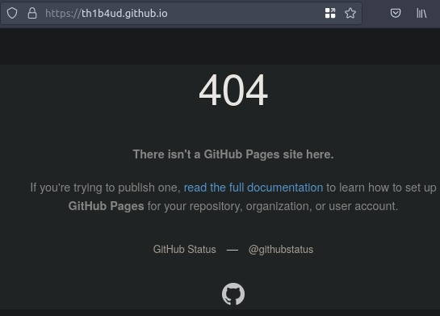

Neither on the main sub-domain.

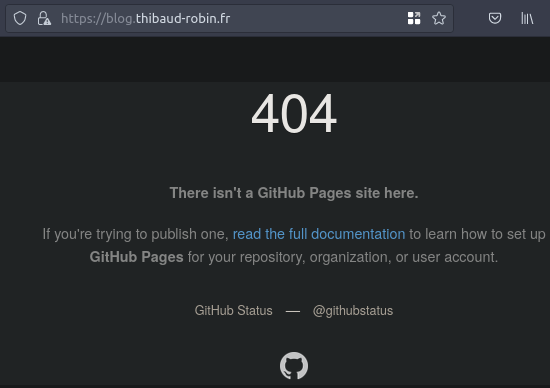

But what's wrong with that ? Hum, like I say before anybody can register a Github account to create a Github page. So it would be possible to create this page as it does not exist, right?

### Exploitation

First step: check that the nickname is not already in use.


`th1b4ud is available`

Great ! It is therefore possible to impersonate this good man.

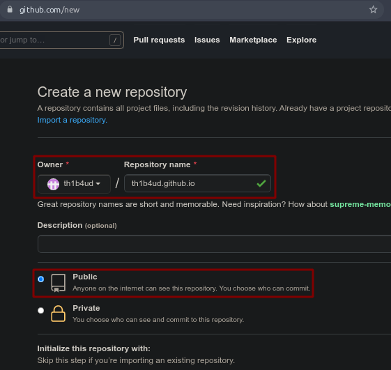

Just need to add some html code to the website index.

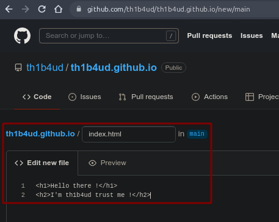

And don't forget to add a CNAME file to point to our victim's website.

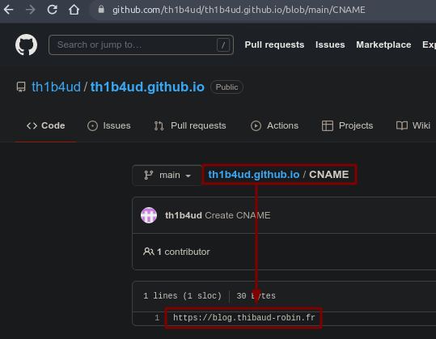



### Results

And voila ! Get hacked théachunbéquatreeudé


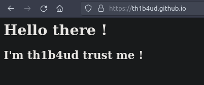

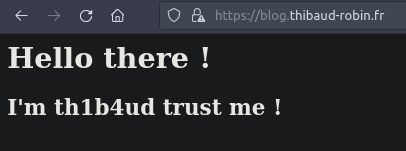

### Remediation

Contrary to Azure detailed below in the article, Github page does not include protection against this type of attack. The only recommendation is to audit your DNS entries frequently and delete all orphan records.

## Case 2 : Azure web application

### What ? Blue color ?

Check this beautiful definiton : 

> Microsoft Azure, often referred to as Azure is a cloud computing service operated by Microsoft. It provides software as a service (SaaS), platform as a service (PaaS) and infrastructure as a service (IaaS) and supports many different programming languages, tools, and frameworks, including both Microsoft-specific and third-party software and systems.

Check this link : https://portal.azure.com/, create a Microsoft account and follow the guide.

### What to pwn ?

To provide some context, the `app` sub-domain has been found. However, it does not contain an `A` record but only a `CNAME` record (hence the option in dig).

```bash
$ dig -t CNAME app.thibaud-robin.fr

;; ANSWER SECTION:
app.thibaud-robin.fr.	2275	IN	CNAME	app-42-th1b4ud-dev.azurewebsites.net.
```

As you see, there is nothing on `app-42-th1b4ud-dev.azurewebsites.net`. The host is not resolved (normal behavior on Azure).

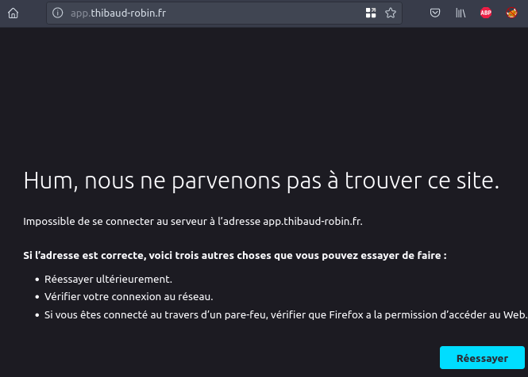

### App deployment

On first step, you have to access to your Azure account to create a new web app.

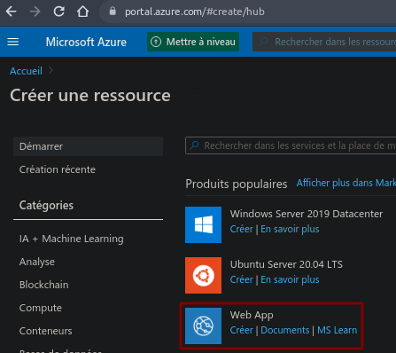

When creating your application, don't forget to add the victim application name you want to hijack (in our case is `app-42-th1b4ud-dev`).

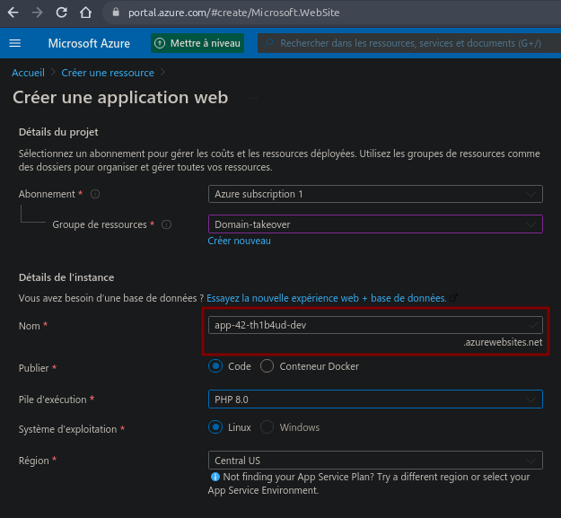

The last creation step will recap all your informations.

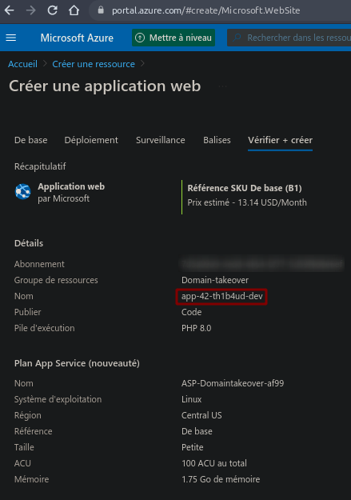

If all went well, you should see your application operational.

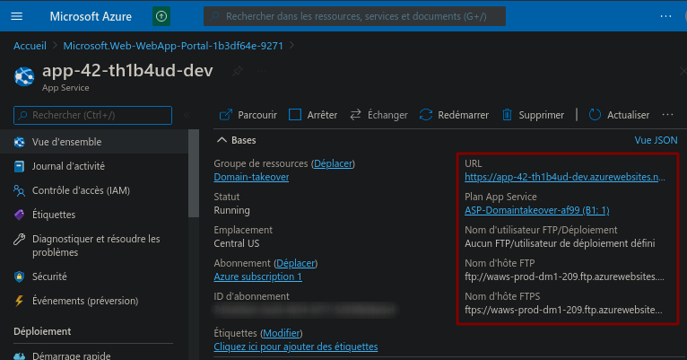

Great perfect !

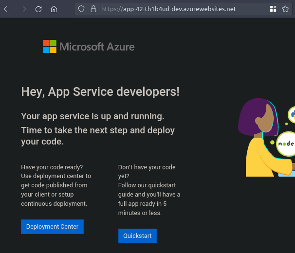

Out of curiosity, the subdomain seems to work and displays an Azure specific error page. It smells good !

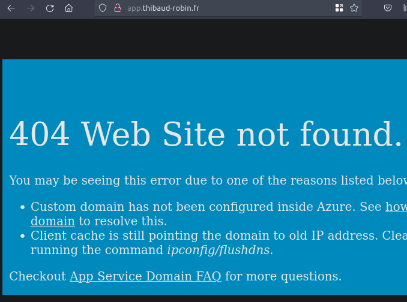

### Pimp your app

The easiest way to add files to our brand new application is to connect directly via FTP to our instance. The accesses are on your panel.

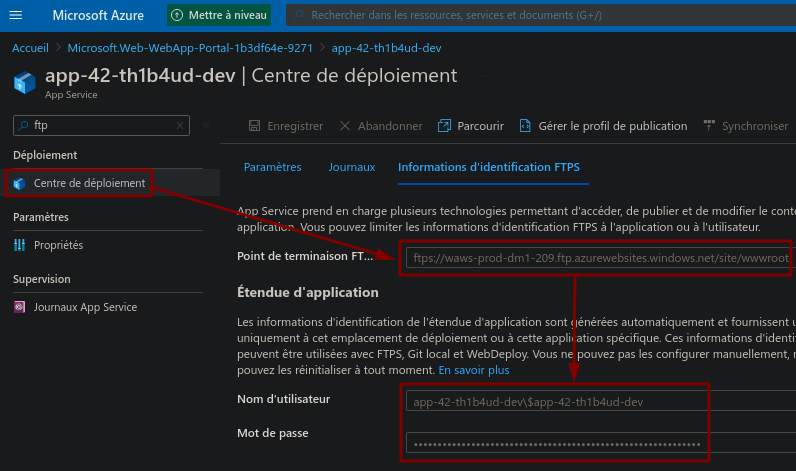

Delete this ugly default page.

```
/site/wwwroot $ ls -al
total 4
drwx------ 1 thibaud thibaud    0 janv. 30 19:52 .
drwx------ 1 thibaud thibaud    0 janv. 30 19:53 ..
-rwx------ 1 thibaud thibaud 3499 janv. 30 19:52 hostingstart.html
/site/wwwroot $ rm hostingstart.html
/site/wwwroot $ code index.html
```

And drop some fancy index page !

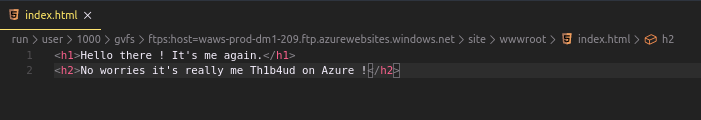

Seems working :D

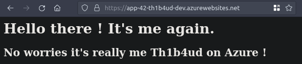

### Subdomain takeover

The last but not least step is to configure our instance to be displayed from a particular `CNAME` (a bit like the `CNAME` file of a Github page). I know it's in french...

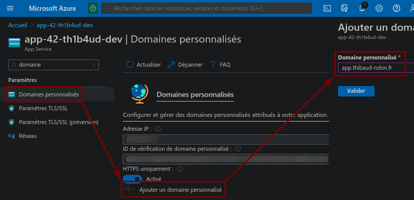

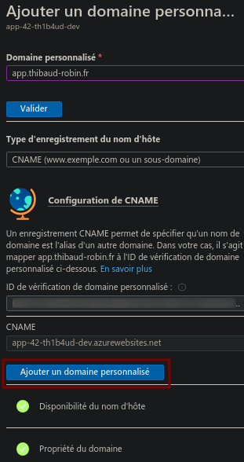

Wait few minutes and voila ! Another successful takeover !

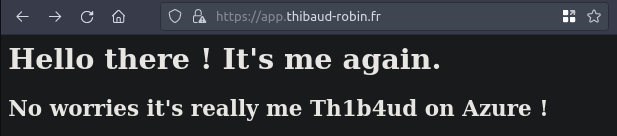


### Remediation

Unlike Github page which does not offer any protection against spoofing, Azure offers an identifier system that acts as protection against this type of attack.

Indeed, when configuring the Azure subdomain you provide an identifier to put in the DNS entries of the target server as a `TXT` entry containing the value of the identifier. Therefore, an attacker creating a new instance will not have this random value. The takeover is therefore impossible.

Unfortunately the configuration of this option is optional and does not prevent an attacker from taking control of a domain that does not contain this identifier.

More infos on [Microsoft documentation](https://docs.microsoft.com/en-us/azure/app-service/app-service-web-tutorial-custom-domain?tabs=a%2Cazurecli#2-get-a-domain-verification-id)


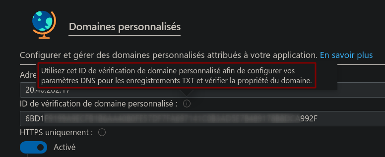

# Conclusion

Taking over a subdomain can pay off in a bug bounty programme. The vulnerability is still quite simple to find, understand and exploit. Here is one of the bounties collected by the [0xPatrick](https://0xpatrik.com/) hunter. Why not the next one for you?

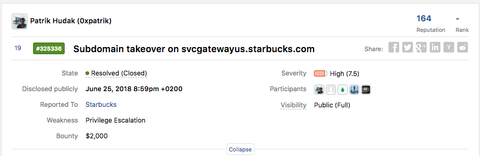

To go further in your research, I recommend the [EdOverflow](https://github.com/EdOverflow/can-i-take-over-xyz) knowledge base. It contains a list of all the platforms that allow you to take control of an application pointed by a bad DNS configuration. And there are plenty of them!

And above all, remember this sentence: "**GET YOURSELF AUDITED FREQUENTLY!!!**"

Stay safe !


Th1b4ud

# Sources

- [0xPatrick blog](https://0xpatrik.com/takeover-proofs/)
- [Hacktricks knowledge base](https://book.hacktricks.xyz/pentesting-web/domain-subdomain-takeover#domain-takeover)
- [OWASP testing guide article](https://owasp.org/www-project-web-security-testing-guide/latest/4-Web_Application_Security_Testing/02-Configuration_and_Deployment_Management_Testing/10-Test_for_Subdomain_Takeover)